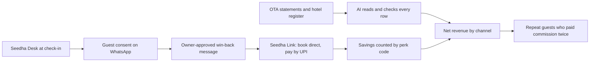
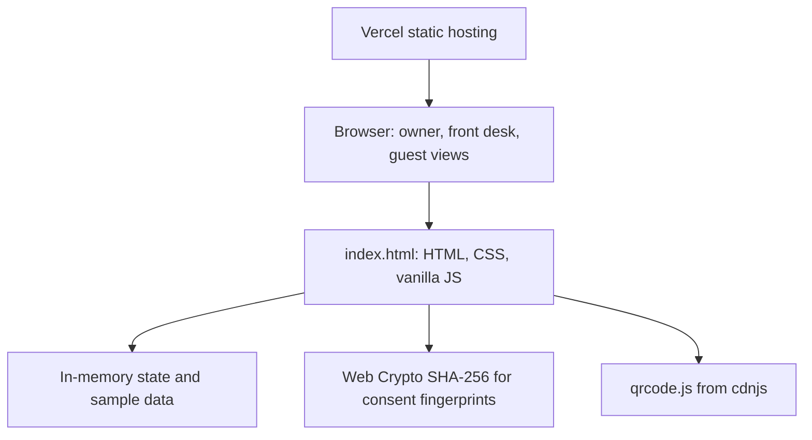
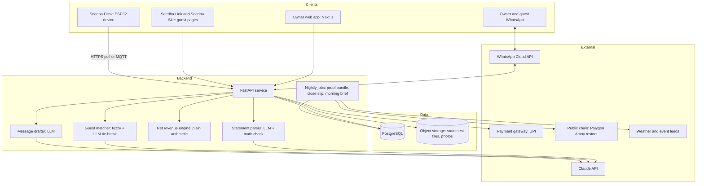
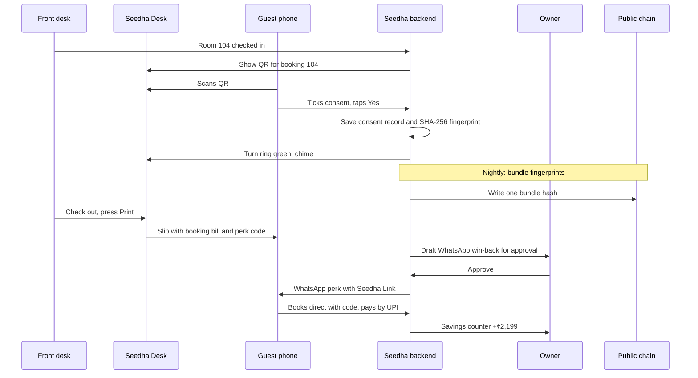
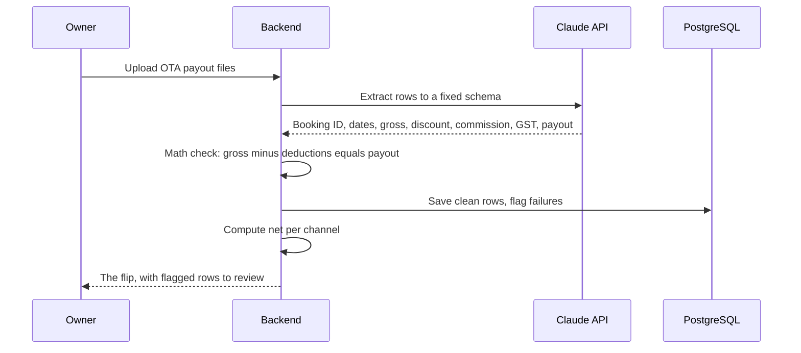
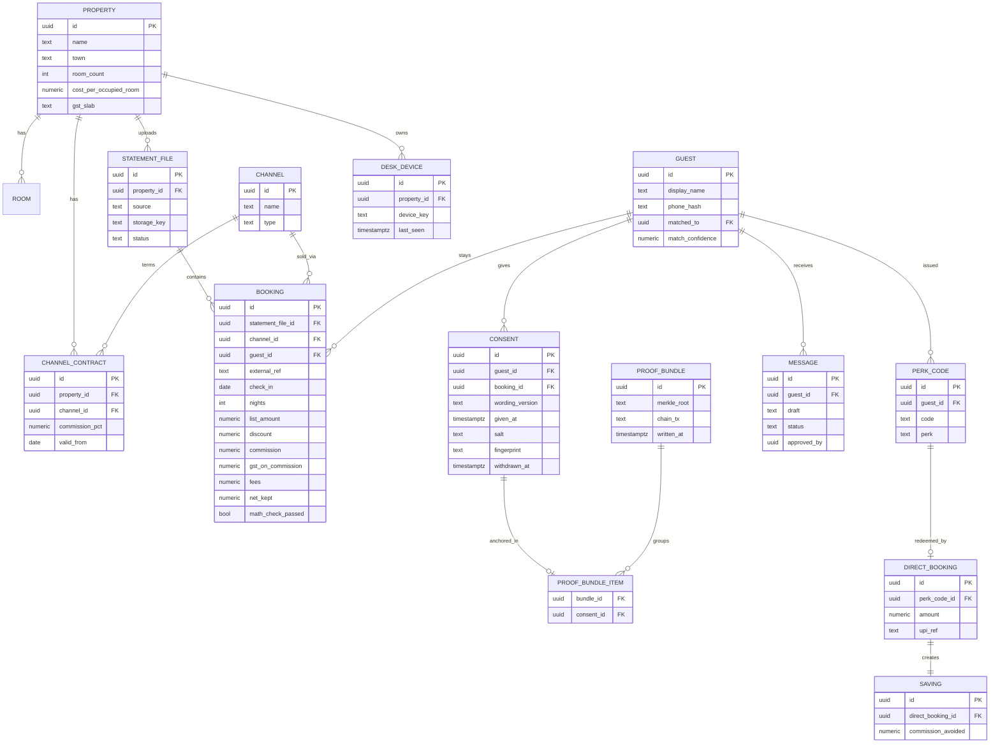
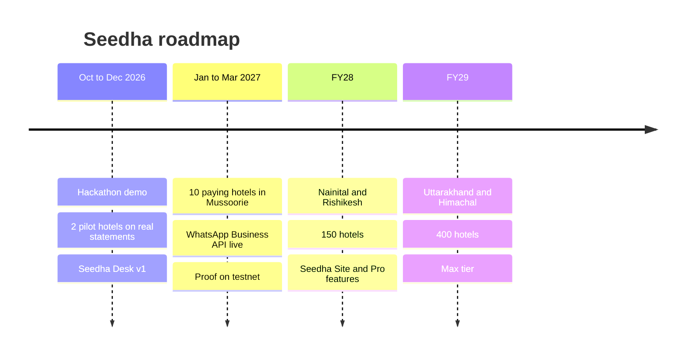

# Seedha

**Know what you really keep.**

Net revenue by channel for India's small hill hotels, and the tools to win guests back direct.

**Live prototype:** https://seedha.vercel.app

| | |
|---|---|
| Event | AI-Tourism Hackathon, Technology Business Incubator, Graphic Era (Deemed to be University), Dehradun, 13 to 14 Oct 2026 |
| Track | Demand Forecasting & Revenue |
| Problem statement | D6: Channel Mix and Distribution Cost Optimisation |
| Stage | Phase 1 prototype (frontend, sample data) |
| Team | Aarav Sharma (lead), Ishan Singh, Madhav Nauriyal, and our hospitality teammate |

---

## Contents

1. [The problem](#the-problem)
2. [What Seedha does](#what-seedha-does)
3. [Try the prototype in 2 minutes](#try-the-prototype-in-2-minutes)
4. [Features and status](#features-and-status)
5. [How the money is calculated](#how-the-money-is-calculated)
6. [Architecture](#architecture)
7. [Data flow](#data-flow)
8. [Database design](#database-design)
9. [Tech stack](#tech-stack)
10. [Where AI is used](#where-ai-is-used)
11. [Seedha Desk hardware](#seedha-desk-hardware)
12. [Seedha Proof](#seedha-proof)
13. [Trust, privacy and legal rules](#trust-privacy-and-legal-rules)
14. [Repository structure](#repository-structure)
15. [Run locally and deploy](#run-locally-and-deploy)
16. [Business model](#business-model)
17. [Research and sources](#research-and-sources)
18. [Roadmap](#roadmap)
19. [Team](#team)
20. [What is real and what is simulated](#what-is-real-and-what-is-simulated)

---

## The problem

A small hill hotel in Mussoorie or Nainital sells rooms through four OTAs, travel agents and walk-ins. The owner sees bookings. He never sees what each channel actually leaves him.

- A ₹4,000 OTA room with a 15% hotel-funded discount and 18% commission leaves ₹2,788 (the organiser's own D6 example). Add 18% GST on that commission and the hotel keeps ₹2,678.
- Since 22 September 2025, rooms up to ₹7,500 a night pay 5% GST **without input tax credit**. A hotel on this slab cannot claim back the GST it pays on OTA commission, so that GST is a dead cost.
- A family that loved the stay books through the OTA again next year, because the hotel never had a contact it was allowed to use. The hotel pays commission twice for a guest it already won.

Ranking channels by bookings is the wrong ranking. Seedha ranks them by money kept.

---

## What Seedha does



1. **Show the truth.** Upload payout statements. See gross vs net per channel. The ranking flips.
2. **Find the leak.** See guests who came back through an OTA and paid commission twice.
3. **Capture consent legally.** Seedha Desk shows a QR at check-in. The guest says yes on their own phone.
4. **Win them back.** The owner approves a WhatsApp perk. The guest books direct on Seedha Link.
5. **Prove the saving.** A saving is counted only when a perk code is used.

---

## Try the prototype in 2 minutes

Open **https://seedha.vercel.app** and follow the Pipeline tab. All data is fictional (Hotel Deodar View, Mall Road, Mussoorie, 22 rooms, April to September 2026).

1. **Owner → Upload →** Use sample statements. Six files are read, 3 rows are flagged.
2. **Money kept →** tap **By money kept**. MakeMyTrip drops from 1st to 5th.
3. **Repeat guests →** confirm the 74% match.
4. **Saturday move →** Accept.
5. **Desk →** Show QR. On the guest phone, tick consent and tap Yes. The ring turns green. Tap **Check out and print**.
6. **Owner → Approvals →** open the Pending proof chip, then go to **Proof** and tap **Write tonight's proof**. The chip becomes Verified. Approve and send.
7. **Guest →** the perk code is prefilled. Pay with UPI.
8. **Owner → Savings →** the gold counter counts up.
9. **Website →** run the setup, approve a package, publish, tap Book.
10. **Pipeline →** all 8 steps show done.

---

## Features and status

| Feature | What it does | Tier | Prototype |
|---|---|---|---|
| Statement upload | AI reads MakeMyTrip, Booking.com, Agoda payouts and the register; a math check flags bad rows | Base | Simulated with sample files |
| The flip | Gross vs net ADR and net RevPAR by channel; ranking reverses | Base | Working |
| Direct True Cost | Payment fees shown on the direct row so direct never looks free | Base | Working |
| Repeat guests | Guests who paid OTA commission twice; owner confirms each match | Base | Working |
| Saturday move | One allocation recommendation with before and after numbers | Base | Working |
| Seedha Desk | QR consent at check-in, LED ring, printed checkout slip and 9 PM close slip | Base | Screen working, hardware in build |
| Win-back approvals | AI drafts a WhatsApp perk; nothing sends without owner approval | Base | Working (send simulated) |
| Seedha Link | Direct booking page with perk code and UPI | Base | Working (payment simulated) |
| Savings ledger | Counts a saving only when a perk code is used | Base | Working |
| Ask on WhatsApp | Six fixed Hindi questions with exact rupee answers | Base | Working |
| Seedha Site | AI builds a website, packages, rate card and agent deck for hotels with none | Base lite, Pro full | Working preview |
| Seedha Proof | Every consent fingerprinted (SHA-256) and anchored nightly to a public record | Pro | Fingerprint real, chain write simulated |
| Seedha Audit | Flags commission overcharges and commission on cancellations | Pro | Preview card |
| Seedha Pulse | Event alerts turned into channel decisions | Pro | Preview card |
| Rate Watch | Flags OTA prices below the direct rate (owner screenshot, no scraping) | Pro | Preview card |
| Plans | Base, Pro, Max with yearly and monthly toggle | | Working |

---

## How the money is calculated

Every rupee in Seedha is arithmetic from the hotel's own statements. AI never writes a rupee figure.

```
list revenue      = room nights × list rate
discount          = hotel-funded discount on that booking
commission        = commission % × (list revenue − discount)
gst on commission = 18% × commission        (not creditable on the 5% room slab)
fees              = payment gateway or UPI MDR on direct bookings
net kept          = list revenue − discount − commission − gst on commission − fees
net ADR           = net kept ÷ room nights
net RevPAR        = total net kept ÷ available room nights
```

TDS (section 194-O) and GST TCS (section 52) are tax credits, not costs, so they are not subtracted from net.

**Sample result (fictional hotel, 6 months):**

| Channel | Room nights | Net ADR | Rank by bookings | Rank by money kept |
|---|---|---|---|---|
| MakeMyTrip | 620 | ₹2,737 | 1 | 5 |
| Booking.com | 310 | ₹3,119 | 2 | 4 |
| Travel agents | 180 | ₹3,420 | 3 | 3 |
| Direct (WhatsApp + UPI) | 160 | ₹4,283 | 4 | 2 |
| Agoda | 140 | ₹2,598 | 5 | 6 |
| Walk-in | 90 | ₹4,500 | 6 | 1 |

Total paid to channels: ₹10,39,108 · channel cost 16.5% of list revenue · net RevPAR ₹1,176 vs list RevPAR ₹1,566.

---

## Architecture

### Phase 1 (this repo, today)



A single static file. No build step, no backend, no database. Every flow runs in the browser so judges can click through the full loop.

### Target system (post-hackathon)



Design rules:
- The money engine is deterministic code. LLMs only read messy files, match names and write sentences.
- The Desk holds no logic. The backend tells it "show QR", "turn green", "print".
- Guest contact data lives only in our database, never on-chain.

---

## Data flow

### Check-in to direct booking



### Statement to the flip



---

## Database design

Planned PostgreSQL schema for the backend (not used by the Phase 1 prototype).



Key choices:
- **Guest phone numbers** are stored only for guests who consented at the Desk. OTA-provided contacts are never stored for messaging.
- **Consent erasure:** deleting the consent row and its salt makes the on-chain fingerprint impossible to link to anyone.
- **Every booking row** keeps `math_check_passed`, so flagged rows never feed the flip silently.

---

## Tech stack

| Layer | Phase 1 (live) | Target |
|---|---|---|
| Frontend | Single `index.html`, vanilla JS, CSS tokens, light and dark mode | Next.js (App Router), React, Tailwind, shadcn |
| Charts | Custom HTML bars | Recharts |
| Backend | None (in-browser state) | FastAPI (Python) |
| Database | None | PostgreSQL (Supabase or Neon) |
| File storage | None | S3-compatible object storage |
| AI | None (sample outputs) | Claude API for parsing, matching tie-breaks, Hindi explanations, message drafts |
| Messaging | Simulated | WhatsApp Cloud API (template messages) |
| Payments | Simulated UPI sheet | UPI via Razorpay or Cashfree |
| Proof | Web Crypto SHA-256 | Merkle bundle written to Polygon Amoy testnet, then a production chain |
| Hardware | Simulated device screen | ESP32, 3.5 inch SPI TFT, WS2812 ring, 58 mm TTL thermal printer |
| Hosting | Vercel (static) | Vercel (web), Fly.io or Railway (API) |
| Auth | None | Phone OTP for owners, device keys for Desks |

---

## Where AI is used

| Job | What the AI does | Guardrail |
|---|---|---|
| Read statements | Extracts rows from any OTA PDF, Excel or CSV into a fixed schema | Math check; rows that do not reconcile are flagged, not used |
| Match guests | Scores whether "Rahul Sharma" and "R. Sharma" are the same guest | Owner confirms anything under 80% |
| Explain | Writes one plain Hindi or English sentence from ledger numbers | Numbers come from the ledger, never from the model |
| Draft messages | Writes the win-back WhatsApp in the guest's language | Nothing sends without owner approval |
| Seedha Site | Builds site copy and package ideas from photos and a voice note | Hotel's own photos only; publish needs owner approval |

The six owner questions on WhatsApp are fixed buttons that run fixed queries. There is no free-text money question, so a rupee figure can never be invented.

---

## Seedha Desk hardware

A small box on the reception counter. It exists to solve one real gap: OTAs hide guest contact details, so the hotel needs a legal way to get consent.

| Part | Job | Approx cost (India, 2026) |
|---|---|---|
| ESP32 DevKit | Brain, Wi-Fi to backend | about ₹499 |
| 3.5 inch SPI TFT | Shows booking-linked QR and status | varies by board |
| 58 mm TTL thermal printer | Prints checkout slip and 9 PM close slip | about ₹1,888 |
| WS2812 12-LED ring | Green on consent, white idle | to price |
| Buzzer and push button | Chime and Print | to price |
| 5V 3A supply (printer on its own rail) | Prevents brownouts from printer current spikes | to price |
| Case | Product look | to price |

Total BOM range: ₹3,500 to ₹6,500 until receipts exist.

Device states: Idle → Show QR → Consent saved (green, chime) → Printing → Error (printer needs paper).

---

## Seedha Proof

- Each consent record (booking ID, time, wording shown) is mixed with a random salt and hashed with SHA-256.
- Every night, the day's fingerprints are bundled into one Merkle root and written to a public chain.
- Anyone can later check that a consent existed at that time and was not changed.
- No names, phone numbers or booking details go on-chain. No tokens are issued.
- Deleting the record and salt makes the fingerprint unlinkable. (Legal position under the DPDP Act still to be confirmed with counsel.)

---

## Trust, privacy and legal rules

1. **Own data only.** Guest contacts provided by OTAs are never used for marketing. Booking.com's General Delivery Terms (clause 2.9.3, as quoted publicly) bar unsolicited use of its guest contacts.
2. **Consent first.** The consent box is unticked by default, and every message has a Stop option. DPDP Rules were notified on 13 November 2025; notice and consent duties apply from 13 May 2027. Seedha is built to them now.
3. **Perks, not undercutting.** Returning guests get breakfast or late checkout, never a lower public rate. CCI ordered MakeMyTrip-Goibibo to remove price and room parity clauses on 19 October 2022 (penalty stayed on appeal), but contracts vary.
4. **No scraping.** Rate Watch reads the owner's own screenshot.
5. **AI never writes money.** Every rupee is arithmetic.

---

## Repository structure

### Today

```
seedha/
├── index.html      # complete Phase 1 prototype
└── README.md
```

### Planned

```
seedha/
├── apps/
│   ├── web/                 # Next.js owner app, Seedha Link, Seedha Site
│   └── api/                 # FastAPI backend
│       ├── parser/          # statement extraction + math check
│       ├── ledger/          # net revenue engine
│       ├── matcher/         # guest matching
│       ├── messaging/       # WhatsApp drafts and sending
│       ├── proof/           # fingerprints and nightly bundles
│       └── jobs/            # morning brief, close slip
├── firmware/
│   └── seedha-desk/         # ESP32 (Arduino framework)
├── db/
│   └── migrations/          # PostgreSQL schema
├── docs/
│   ├── architecture.md
│   └── screenshots/
└── prototype/
    └── index.html           # Phase 1 prototype, kept for reference
```

---

## Run locally and deploy

**Run:** download the repo and open `index.html` in any browser. No install.

```bash
git clone https://github.com/aaravfractal/seedha.git
cd seedha
open index.html          # Mac
```

**Deploy:** connected to Vercel. Every push to `main` redeploys https://seedha.vercel.app.

```bash
git add .
git commit -m "Update prototype"
git push
```

---

## Business model

| Plan | Price (hypothesis) | Includes |
|---|---|---|
| Base | ₹1,499 a month (₹14,990 yearly) | Flip, repeat guests, Desk, win-back, Seedha Link, savings, simple site |
| Pro | ₹2,499 a month | Base + full Seedha Site, Audit, Pulse, Rate Watch, Proof |
| Max | ₹3,999 a month | Pro for two properties |
| Seedha Site only | ₹4,999 one time | Website, packages, rate card, agent deck |

Value check: one coded 2-night direct stay at ₹4,300 a night avoids about ₹2,233 in commission plus non-creditable GST (₹8,600 × 22% × 1.18). Minus about ₹34 UPI fee, that is about ₹2,199 net, more than a month of Base.

All prices are hypotheses until tested with hotel owners.

---

## Research and sources

Verified in a research pass on 8 October 2026. Vendor claims are shown as ranges only.

| Fact | Value | Source |
|---|---|---|
| GST on rooms up to ₹7,500 | 5% without ITC from 22 Sep 2025 (was 12% with ITC) | 56th GST Council; CBIC Notification 15/2025-CT(R) |
| CCI order on MakeMyTrip-Goibibo | ₹223.48 crore penalty, parity clauses ordered out, 19 Oct 2022; penalty stayed 6 Dec 2022 | PIB release 1869330; NCLAT stay reports |
| DPDP Rules | Notified 13 Nov 2025; consent duties from 13 May 2027 | MeitY, G.S.R. 846(E) |
| UPI merchant MDR | 0.4% above ₹2,000, cap ₹300, announced for 15 Oct 2026; small QR merchants exempt | Media reports citing NPCI, Sep 2026 |
| Uttarakhand visits 2025 | 6,03,21,194 | UTDB footfall file 2025 |
| Mussoorie visitors | 21,34,626 (2024); 15,94,221 (2025) | UTDB footfall files |
| Himachal properties | 5,163 hotels + 5,855 homestays | Tourism director via Jagran, 21 May 2026 |
| OTA commission | Commonly quoted 15 to 25% for independents | Vendor and consultant pages (no official rate card) |
| WhatsApp pricing | Per delivered template since 1 Jul 2025; India marketing about ₹0.86 | Meta developer docs; rate-card summaries |
| India channel ranking 2025 | GoMMT, Agoda, Booking.com, Cleartrip, STAAH SwiftBook | STAAH's own network data |

---

## Roadmap



Next technical milestones:
1. Real statement parser for MakeMyTrip, Booking.com and Agoda formats.
2. FastAPI backend with the PostgreSQL schema above.
3. WhatsApp Cloud API with one approved utility template.
4. Seedha Desk firmware with HTTPS polling and printer on a separate supply.
5. Nightly Merkle bundle on Polygon Amoy.

---

## Team

| Name | Role |
|---|---|
| Aarav Sharma | Lead, product and markets |
| Ishan Singh | Engineering |
| Madhav Nauriyal | Engineering and AI |
| Hospitality teammate | Revenue terms, owner research |

---

## What is real and what is simulated

| Part | Status |
|---|---|
| Frontend and full 8-step loop | Working |
| Data | Fictional sample hotel |
| Statement parsing, WhatsApp sending, UPI payment | Simulated in the browser |
| SHA-256 consent fingerprints | Real (Web Crypto) |
| Blockchain write | Simulated |
| Seedha Desk hardware | Designed, in build |
| Owner survey and real hotel statements | In progress |

Users today: zero, deliberately. Every claim in this README is either working in the prototype or labelled as planned.
